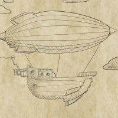

## HoloLens2 Translator (**2023**) {:class="project-thumbnail"}

A near real-time augmented reality translation application for Microsoft's HoloLens2 device built with Unity and Azure Cognitive Services as part of University College Dublin's MSc in Computer Science Summer Project program.

---

## Potato Panic (**2023**) {:class="project-thumbnail"}

A potato farming game built in Unity for Global Game Jam 2023 at University College Dublin with the theme of "**Roots.**"

---

## Mystery at the Ghost Party (**2021**) {:class="project-thumbnail"}

A wealthy ghost has invited you to his manor for a party where his precious artifact has been stolen. Without it, he will descend into madness and be destroyed. This game was developed in Unity for Global Game Jam 2021 by a remote team collaborating through the Chico State jam site with the theme of "**Lost and Found.**"

---

## Richard's Adventure (**2020**) {:class="project-thumbnail"}

A steampunk-themed airship building and racing game developed in Unity for Global Game Jam 2020 at Chico State with the theme of "**Repair.**"

---

## Home is Where the Pizza's At (**2019**) {:class="project-thumbnail"}

You lost everything from your previous home. You got fired from your job. Your parents disowned you. Your wife left you and took the house with her. You had no friends to turn to, and it seemed like all hope was lost. You remember what your late grandmother taught you: Her recipe for the most wonderful food known to mankind. Pizza. You always kept your grandmother close to your heart. Pizza is all you know. Pizza is all you have. You move out of the country for a fresh start. You start your own pizza place. This is where you are home, because home is about being free to pursue your passion. Your passion is pizza. Home is where the pizza's at.

This game was developed in Unity for Global Game Jam 2019 at Chico State with the theme of "**What home means to you.**"

---

## Adrift (**2015**) {:class="project-thumbnail"}

A small crew has been sent on a galactic voyage in search of habitable planets / intelligent life. Unfortunately, a mechanical error has left them stranded. This game was developed as a solo project in Unity for Global Game Jam 2015 at Chico State. It was released on the Amazon App Store as an Android app in late 2015, and is currently still available.

---

## Can Hue See Me (**2014**) {:class="project-thumbnail"}

Multiplayer tag game developed in Unity using Photon Unity Networking for Global Game Jam 2014 at Chico State with the theme of "**We don't see things as they are, we see them as we are.**" The game was highly dependent on its multiplayer configuration, and the Photon server for this application is no longer available, so unfortunately it can't be played anymore, but it was a fun and ambitious exploration of online multiplayer for a game jam.

---

## Vascular Voyage (**2013**) {:class="project-thumbnail"}

An endless runner game for mobile platforms developed in Unity for Global Game Jam 2013 at Chico State where the theme was "**The Sound of a Heartbeat.**" It was released on the Google Play Store, but has since been taken down since the version of Unity it was developed with is no longer supported.

---

## Culture Clash (**2012**) {:class="project-thumbnail"}

An arcade game featuring a bacterial organism that eats food, avoids viruses, grows, and evolves. Developed as a solo game project in Unity for Ludum Dare in Summer 2012 with the theme, "**Evolution,**" it was released on Kongregate, but eventually fell out of support with the Unity Web Player. This was my first complete Unity project after switching away from UDK and XNA (which was in decline at the time).

---

## Snake Eyes (**2012**) {:class="project-thumbnail"}

My first game jam project, Snake Eyes was developed in XNA for Global Game Jam 2012 at Chico State where the theme was "**A picture of an Ouroboros**." I was the only programmer in a team of artists, which was a fun experience, as I was getting pelted with incredible artwork faster than I could implement it into the project. The end result was quite different than the initial design due to time constraints, but it was a fantastic learning experience and started my passion for game jams.

---

## Communists vs Zombies (**2011**) {:class="project-thumbnail"}

CvZ is a mobile tower defense game developed in UDK by Chico State Game Studios. Initially it had been more of a real-time strategy minion/puzzle game, but it pivoted genres late in development after pressure from time constraints came down on the project. I worked as co-lead of the programming team, managing roughly 6 other programmers working across all the other departments in this 60+ person project. At the final release party I was also awarded the Max P. Giganti award for cross-discipline collaboration. (The first non-Max to receive the award). The final product was not as successful as we would have liked, and is difficult to find traces of now that CSGS has shut down the page for it, but it will always be a special project for me.

---

## Dynamaze (**2010**) {:class="project-thumbnail"}

Developed in 3D XNA/C# for PC (with dreams of going on the Xbox 360), Dynamaze utilized a modified version of a recursive division maze algorithm. A spaceship travels through mazes that grow progressively larger and more complicated while dodging mines and fighting off swarms of drones, searching for portals to advance to the next level.

---

## 40 Stories (**2010**) {:class="project-thumbnail"}

A puzzle game developed in UDK by Chico State Game Studios, 40 Stories was submitted to IGF and received a small amount of critical acclaim. I worked on the programming team for this project, focusing on animation programming, gameplay mechanics, and tools for level designers. This was one of my favorite projects, and a game that I'm still proud of, despite it having nearly disappeared from the internet.

---

## Blotto Box (**2009**) {:class="project-thumbnail"}

A hacker themed real-time strategy game developed in GameMaker for my Senior Game Development class. It was originally intended to be developed in XNA in 3D, but we weren't able to learn the technology quick enough for the class's time constraints, so the final result was a refined version of its GameMaker prototype.

---

## Evil Tech (**2009**) {:class="project-thumbnail"}

My first game project developed in GameMaker for my Digital Prototyping Game Design class, Evil Tech was a bizarre mashup of various game genres. It opens with a side scrolling beat-em-up, goes into a sort of stealth-based RPG with random encounters, and finishes with a side-scrolling boss battle. While it is wildly inconsistent in theme and story, it still manages to be kind of fun, and I think the boss battle at the end still holds up (unfortunately getting to it is a slog).

---